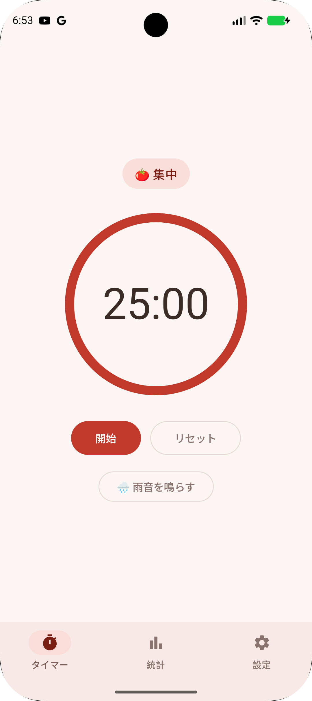

#  Dorodoro Timer 🍅⏱

**ANR（Application Not Responding）をわざと起こせるポモドーロタイマー。** DroidKaigi 2026 セッション **[「あなたのANRはどこから？ — 発生する仕組みを診断し、症状別に処方する」](https://2026.droidkaigi.jp/timetable/1236227/)** のサンプルアプリ。

「集中作業用タイマー」という普通のアプリのコードに、ANR の原因になる実装を自然な形で埋め込んである。設定画面のトグル（demoMode）を ON にすると、デモ用の発火ボタンではなく**普通に操作するだけで実際に固まる**。仕込んだ箇所にはすべてマーカーコメント `// [ANR-xx]` が付いていて、この README の対応表から辿れる。

<p align="center"></p>

- **セッション**: DroidKaigi 2026 / 2026-09-02 16:20–17:00 / Narwhal / chomi — https://2026.droidkaigi.jp/timetable/1236227/
- **demoMode OFF（既定）では ANR は一切起きない**。標準コードはリリース品質の正しい実装で、多くの事例には「正版」（処方を適用した実装）が並置してある。

## 試してみる（Quick start）

もっとも確実に再現できる **ANR-03（起動 × ロック競合）** を例にする。時間基準（ロックを 25 秒保持）なので端末スペックに依存しない。

1. ビルドしてインストールする（[ビルド・実行](#ビルド実行)参照）

   ```bash
   ./gradlew :app:installDebug
   ```

2. アプリを起動し、**設定**タブを開く
3. **「🧪 デモモード（ANR再現）」**（マスタートグル）を ON にする
4. **「ANR-03 ディープリンク×ロック競合」** を ON にする → 再起動ダイアログが出るので**「再起動する」**を選ぶ
5. 再起動した直後（25 秒以内）に**統計**タブを開く
6. 画面が凍る。そのまま何度かタップすると、**約 5 秒で ANR ダイアログ**（「Dorodoro Timer が応答していません」）が表示される

裏で起きていること: 起動時にワーカースレッドが統計ストアの初期化ロックを 25 秒握り、統計画面がメインスレッドから同じロックを同期取得しに行って凍る。入力イベントが 5 秒ディスパッチされないと ANR。詳細は `data/local/stats/StatsStore.kt` と `feature/stats/StatsScreen.kt` の `[ANR-03]` マーカー参照。

## demoMode の仕組み

- **マスタートグル ＋ ANR ごとの個別トグル**（設定画面）。`DemoConfig.isOn(Anr.XX)`（= master AND 個別）が ON のときだけ ANR 誘発経路を通る。**リリースビルドでは常に OFF**。
- 標準コードは正しい（リリース品質）実装。分岐は**原則 DI（Koin）で実装ごと差し替え**、呼び出し側はクリーンに保ち、before/after が実装ファイル単位で並ぶようにしている。
- DI で差し替えにくい局所（`onReceive` 内、`startForeground` 直前など）だけ、その場に `if (DemoConfig.isOn(Anr.XX)) { /* [ANR-xx] */ }` を置く。
- 起動時に一度だけ配線される事例（DI の `single`、`Application.onCreate` 内の分岐）はトグル変更時に再起動を求める。

## ANR 事例 ↔ コード対応表

> 軸: busy = メインスレッドが作業中 / waiting = 待たされ。配置列はファイルパスのみ（行番号は実装が変わるとずれるため載せない）。正確な位置は各 `[ANR-xx]` マーカーで検索する（例: `grep -rn "\[ANR-01\]" app/src/main/java`）。

| ANR-ID | 事例 | 軸 | 締切種別 | 主な配置 | 処方 | 状態 |
| --- | --- | --- | --- | --- | --- | --- |
| ANR-01 | メインスレッド I/O（生SQLite vs Room） | busy | input（5秒） | `di/AppModule.kt` / `data/local/stats/BlockingStatsRepository.kt` | Room の suspend DAO に任せる。守ってくれないライブラリは自前で `withContext(IO)` | 実装済み |
| ANR-02 | `Application.onCreate` の重い初期化 | busy | 起動 | `app/DorodoroApplication.kt` / `app/startup/StartupGate.kt` | onCreate は予約だけにしてワーカースレッドで実行 | 実装済み |
| ANR-03 | 起動 × ロック競合 | waiting | input（5秒） | `data/local/stats/StatsStore.kt` / `feature/stats/StatsScreen.kt` | メインから同期アクセスしない。初期化とロック保持を分離 | 実装済み |
| ANR-04 | Keystore 風の鍵生成（Binder + セキュアHW IPC） | waiting | 起動（bindApplication 15秒） | `vendor/securevault/SecureVaultKeyBootLoader.kt` / `vendor/securevault/SecureVaultService.kt` | 起動クリティカルパスでメインスレッド同期取得しない | 実装済み |
| ANR-05 | 背面起動 ANR（WorkManager / AlarmManager 起点・ANR-02 と連結） | busy | 起動（bindApplication 15秒） | `app/startup/StartupOrigin.kt` / `service/work/AnrLogUploadScheduler.kt` | ANR-02 と同じ「onCreate は予約だけ」。doWork 自体は無罪 | 実装済み |
| ANR-06 | BroadcastReceiver（`onReceive` 重処理） | busy/waiting | broadcast | `service/TimerAlarmReceiver.kt` / `service/ReceiverWork.kt` | `goAsync()` / 処理をメイン外へ | 実装済み |
| ANR-07 | DexFile / ClassLoader（起動時集中） | busy/waiting | 起動 | — | Koin `lazyModule` で遅延 | 未着手 |
| ANR-FGS | `startForeground` の猶予超過 | waiting | service | `service/AmbientSoundService.kt` / `service/FgsStartupWork.kt` | 即 `startForeground` を呼び、重い初期化は後（別スレッド）へ | 実装済み |

以下、表に収まらない各事例の補足。

### ANR-01: 端末スペック依存で出ないことがある

ANR-01 のシード書き込みは行数固定（5000 行を1件ずつ非トランザクション INSERT）のため、高性能な実機では一瞬で終わり、入力ディスパッチの 5 秒締切に届かず ANR にならないことがある。これは欠陥ではなく、**同じコードでも端末スペックで ANR が出たり出なかったりする、という ANR の環境依存性の実例**。エミュレータや廉価端末では再現する。端末非依存で確実に固めたい場合は、時間基準の ANR-03（25 秒保持）や ANR-05 を使う。

### ANR-03: 正版（処方後の実装）

`data/local/stats/StatsStore.kt` の `warmUpReactive` / `readiness`（マーカー `[ANR-03][正版]`）。

- `DorodoroApplication.onCreate` は `appScope.launch` で予約するだけで誰も待たない。
- **正版は自前ロックを持たない**。重い初期化は `Dispatchers.Default` で回し、相互排他は「Application から1回だけ起動する」構造で、結果の公開は `StateFlow` への書き込みで担保する。ロックを消したのではなく、待たせない仕組みへ移している。
- ロックが要る場合の一般形は「重い処理はロックの外、**ロック内は代入だけ**」（保持時間をミリ秒未満に落とす）。
- `StatsScreen` は `awaitReady()` を呼ばず `readiness`（`StateFlow`）を observe するだけ。準備中は画面を覆わず、上に小さなインジケータを出す（Loading → Ready の観測。メインは待たない）。
- 排他が要る場面では `synchronized` ではなく `Mutex.withLock`（suspend で待つのでメインを凍らせない）。

出典: [ANR ドキュメント（Android Developers）](https://developer.android.com/topic/performance/vitals/anr)

### ANR-04: 正版と「待ち方を変える」処方

相手がシステムサービス／セキュアハードウェアの IPC の場合、**呼び出し自体を速くする手段は無く、待ち方を変えるしかない**のがこの事例の核。

正版は `vendor/securevault/SecureVaultKeyProvider.kt`（マーカー `[ANR-04][正版]`）。`StatsViewModel.reload` から呼ばれ、①メイン外（`Dispatchers.IO`）で実行 ②一度だけ生成してファイルキャッシュ ③統計画面を開くまで遅延、の3点で onCreate 同期版と対比させている。

### ANR-05: 背面起動 ANR の再現（ANR-02 と2つ ON）

設定画面で **master ON / ANR-02 ON / ANR-05 ON**（ANR-03 は OFF）にして再起動する。この時点で**前面起動は従来どおり生き残る**（約 9〜12 秒。ANR-02 の入力 5 秒は破るが文鎮化はしない）。ANR が出るのは**背面で起こされた起動だけ**で、そちらの締切は `bindApplication` の **15 秒 × `ro.hw_timeout_multiplier`** ひとつしかない。

**いちばん簡単な再現（アラーム経路・adb 不要・操作は2つ）**:

1. タイマーを短く（1分など）にして**開始**
2. タスク一覧（Recents）からアプリを**スワイプで終了**（⚠️ 設定アプリの「強制停止」は仕掛けごと消えるので不可）
3. あとは放置。タイマー終了時刻にアラームがプロセスを起こし、**約 15 秒後に無言で kill** される（画面には何も出ない。証拠は下の「観測」）

**WorkManager 経路（1コマンド）**: `./scripts/demo-anr05.sh` — 武装 → kill → 目覚まし待ち → 起動理由の表示 → ApplicationExitInfo の確認まで自動で行い、各段階を実況する。前回の残骸・生き残りプロセス・期限切れ Work があっても通るので連続で回せる（1回あたり約1分）。スクリプトが吸収している端末側の事情:

- `am kill` は対象が cached に落ちるまで no-op なので、**pid が消えるまでリトライ**する（1発撃って sleep する方式だと取りこぼす）
- 非給電の端末では JobScheduler の**クォータ**が効き、繰り返すと `WITHIN_QUOTA` が外れて鳴らなくなる → 給電中に見せかける（戻すには `adb shell cmd battery reset`）
- Android 15+ の**フレキシブルなジョブ実行**でまとめて実行されるため、初期遅延が切れてから実際に鳴るまで更に 1〜2 分かかることがある → フレックスを切り、遅延が切れたら強制実行で前に倒す（戻すには `adb shell cmd jobscheduler reset-flex-policy`）

**観測**（どちらの経路でも）:

```bash
adb shell getprop ro.hw_timeout_multiplier   # 空か 1 でなければ締切が15秒ではない
adb logcat | grep -E "ANR in|failed to complete startup|bg anr"
adb shell dumpsys activity exit-info com.pelantica.dorodorotimer
```

- ⚠️ **`am force-stop` は使わない**。ジョブもアラームも一緒に消えて、プロセスを起こす仕掛けが無くなる。プロセスを殺すのは `am kill`（cached になってから。前面のままだと効かない）。
- **背面 ANR はダイアログを出さない**。`Killing ... (adj 0): bg anr` で無言 kill され、痕跡は ApplicationExitInfo（`reason=6 (ANR) subreason=34 (BIND APPLICATION ANR)`。`anrInfo` が付く場合は `isUserPerceptible=false` も見える）と、次回起動時に Crashlytics が拾って送るレポートだけ。
- 目覚ましの Work は**前面起動のときだけ**張り直す（`ExistingWorkPolicy.REPLACE`）。背面起動から同じ一意名を触ると自分を起こした Work を壊すため。
- 安全弁: 直前が ANR 死なら次の起動は重い初期化をスキップする（`StartupOrigin.lastExitWasAnr`）。再配送ループでの連続 ANR とデモ機の文鎮化を防ぐ。**それでも開けなくなったら脱出は `adb shell pm clear com.pelantica.dorodorotimer`**（demoMode のフラグも消える）。

### ANR-FGS: startForeground 猶予超過の再現

厳密には ANR ではなく `ForegroundServiceDidNotStartInTimeException` による**クラッシュ**。「startForeground は 5 秒以内に」という値はアプリが守るべき契約であって、**実際に kill されるまでの猶予はこれとは別物**、というのがこの事例の核。

設定画面で **master ON / ANR-FGS ON** にしたうえで:

1. タイマー画面の時間表示をタップして集中時間を **0:40**（40 秒）に設定する
2. **「開始」**をタップした直後に **HOME キー**でアプリを背面へ退避する
3. 40 秒後にタイマー終了アラームが鳴り、`AmbientSoundService`（雨音 FGS）が背面から起動される。そこから **35 秒放置**すると `ForegroundServiceDidNotStartInTimeException` でクラッシュする（ANR ダイアログは出ない無言 kill）
4. **前面**から確認したい場合は、タイマー画面の**「🌧️ 雨音を鳴らす」**ボタンでも同じ例外が発生する。ただしこちらは**先に 20 秒で Service 実行 ANR（ダイアログ付き）が出た後**にクラッシュする点が背面経路と異なる

Android 17（API 37）エミュレータでの観測では、kill までの猶予は前面・背面で共通の 30 秒（`service_start_foreground_timeout_ms`）。前面は 20 秒で Service 実行 ANR ダイアログ → 30 秒で同じ例外により kill。背面は ANR ダイアログを経由せず無言で kill され、痕跡は `data_app_crash` と ApplicationExitInfo `reason=4 (APP CRASH)`。**他の API レベル・実機では猶予秒数やダイアログの有無が変わりうる**ため断定はしない。デモで 35 秒メインを塞ぐのは、前面・背面どちらの締切も確実に超えるため。

## 設計上のポイント

### 永続化: ライブラリがスレッドを管理してくれるかを見極める（ANR-01 の核）

| ライブラリ | スレッドの扱い | 役割 |
| --- | --- | --- |
| Room | suspend/Flow DAO は IO へ逃す | 「守ってくれる」例 |
| SQLDelight | クエリはデフォルト同期実行 | 「守ってくれない」例 |
| DataStore | suspend/Flow で非同期 | 補助 |

> ⚠️ SQLDelight は AGP 9 未対応のため現在**無効化中**（`.sq` と TODO は残置）。「守ってくれない」側は生SQLite（`data/local/stats/RawSqliteStatsHelper.kt` + `BlockingStatsRepository`）で代替している。

### StrictMode（デバッグビルドのみ・気づく側の実演）

ANR を仕込む demoMode とは**独立**して、デバッグビルドでは常にメインスレッドのディスク I/O を検出する（`core/debug/StrictModeInstaller.kt`）。違反が出ると画面上部にバナーが出て、タップすると Android が出力したスタックトレース全文を表示する。仕込み側ではなく気づく側のため、マーカー `[ANR-xx]` は付けていない。

- **ネットワークは OS が既定でメインスレッド禁止**（`initThreadDefaults` が `detectNetwork` + `penaltyDeathOnNetwork` を入れる＝`NetworkOnMainThreadException` の正体）。一方**ディスク I/O は既定では検出すらされない**ので、自分でスイッチを入れる必要がある。
- 既定ポリシーを引き継ぐため `ThreadPolicy.Builder(StrictMode.getThreadPolicy())` から組み立てる。`Builder()` を新規に作ると `penaltyDeathOnNetwork` が消え、**デバッグビルドの方がリリースより緩くなる**罠がある。
- `penaltyDeath` は使わない。落とさずに気づかせるのが目的。
- リリースビルドでは `BuildConfig.DEBUG` で丸ごと無効。

## 技術スタック

Kotlin / Jetpack Compose (Material3) / Koin（DI）/ Room + DataStore（SQLDelight は AGP 9 対応待ちで無効化中）/ WorkManager / Firebase Crashlytics。Version Catalog 管理・単一モジュール。minSdk 26 / targetSdk 36。

## ビルド・実行

Android Studio で開いて Run するのが確実（同梱の JBR = JDK 21 を使う）。CLI では JDK 21 を指す `JAVA_HOME` で:

```bash
./gradlew :app:assembleDebug   # ビルド
./gradlew :app:installDebug    # 接続中の端末へインストール
```

## パッケージ構成

```
com.pelantica.dorodorotimer
├── app/            Application（Koin 起動）/ startup/（ANR-02 の SDK風初期化と StartupGate）
├── di/             Koin モジュール（demoMode 差し替え）
├── core/debug/     DemoConfig（demoMode のフラグ）/ StrictMode バナー
├── core/ui/        Theme / SectionCard
├── feature/timer/  タイマー画面（ポモドーロ本体・時間ホイール）
├── feature/stats/  統計画面（日別集計・デモ用シードの2セクション表示）
├── feature/settings/ 設定画面（demoMode トグル・開発ツール）
├── data/local/     Room / DataStore / 生SQLite（SQLDelight は無効化中）
├── domain/model/   PomodoroPreset / TimerPhase
├── domain/repository/ データ層のインターフェース（DI で実装を差し替える境界）
├── service/        AmbientSoundService（雨音FGS）/ TimerAlarmReceiver / work/（ANRログ送信Work）
└── vendor/         SecureVault（ANR-04 の別プロセス鍵庫の模型）
```

## 注意書き

- これは **ANR の仕組みを学ぶための教材**であり、ANR・クラッシュは意図的に仕込まれている。demoMode を ON にした状態での挙動（フリーズ・無言 kill・クラッシュ）はすべて仕様。
- demoMode の ON/OFF はデバッグビルドの設定画面からのみ操作でき、リリースビルドでは常に OFF。
- タイマー・統計・設定の各機能自体はリリース品質で動作する。
